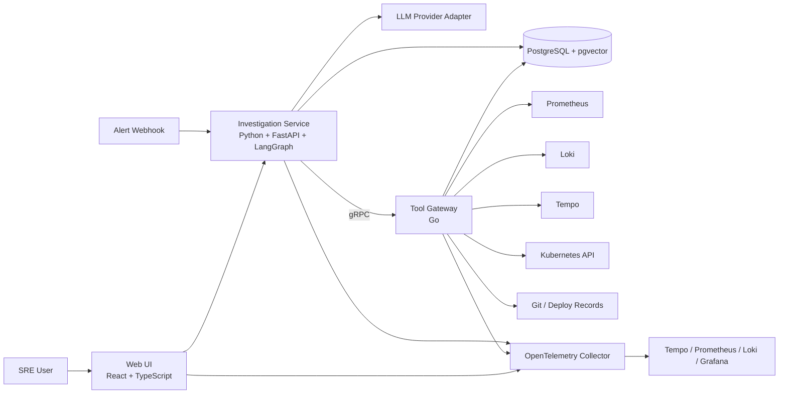
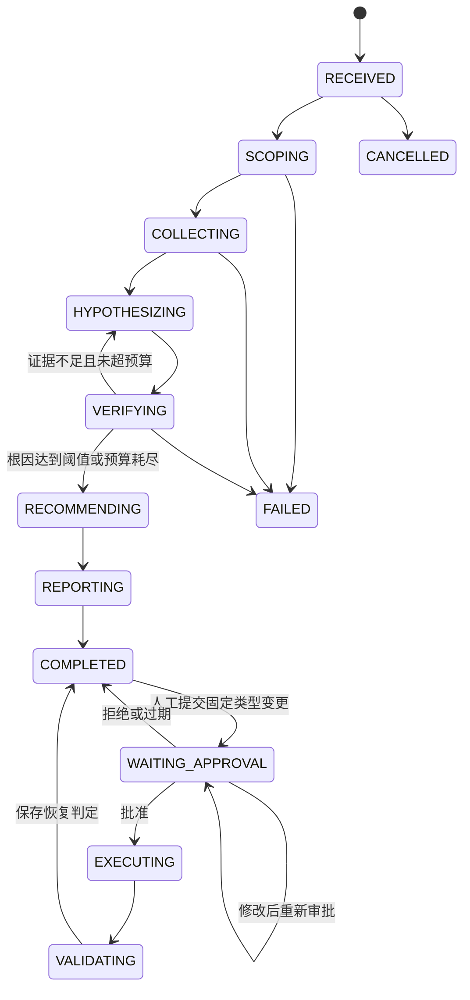

# 架构设计

## 1. 架构目标

系统应在不信任 LLM 输出的前提下完成多源故障调查。架构必须同时支持：

- 明确的调查状态和终止条件。
- 证据可追溯和结论可解释。
- AI 与高权限凭据隔离。
- 人工暂停、审批和恢复。
- 失败重试、幂等和降级。
- 全链路 Trace 与离线回放。

## 2. 架构原则

1. LLM 负责语义判断，不负责最终授权。
2. 规则和真实工具结果优先于模型猜测。
3. 每个副作用都必须位于可重试、可审计的边界内。
4. 原始观测数据与 LLM 总结分开保存。
5. 大数据先在数据源侧过滤聚合，不将无限日志塞入上下文。
6. 单 Agent 显式工作流优先于多 Agent 自由协作。
7. 不可用的数据源产生“证据缺失”，不能被模型补全。

## 3. 容器级架构



## 4. 组件职责

### 4.1 Web UI

- 创建和查看调查。
- 以时间线展示状态节点、工具调用和证据。
- 展示候选根因、置信度、支持证据和反证。
- 提供批准、修改、拒绝操作的界面。
- 查看评测报告、成本和 Trace 链接。

Web UI 不直接调用工具网关，不持有集群凭据。

### 4.2 Investigation Service

- 接收告警并创建调查状态。
- 执行 LangGraph 调查图。
- 生成查询计划和候选假设。
- 调用 Go 工具网关获取真实数据。
- 对证据进行裁剪、排序和上下文构建。
- 执行结构化模型调用和结果校验。
- 持久化检查点、报告和评测结果。
- 管理独立于模型检查点的审批状态与动作前后验证。
- 通过 SSE 向 Web UI 推送进度事件。

### 4.3 Tool Gateway

- 保存数据源连接配置和最小权限凭据。
- 对工具名、参数、时间范围和返回大小执行校验。
- 对多个只读数据源执行并发访问、超时和有限重试。
- 对变更操作执行 RBAC、审批令牌、幂等键和目标绑定校验。
- 保存不可抵赖的工具审计记录。
- 对输出执行大小限制和基础脱敏。

Tool Gateway 不调用 LLM，也不自行生成根因结论。

### 4.4 PostgreSQL 与 pgvector

- 领域数据：调查、步骤、证据、假设、审批、操作和报告。
- LangGraph 持久化检查点。
- Runbook、服务说明和历史事故元数据及向量。
- 评测数据集版本、运行结果和指标。

V1 不把大段原始日志重复写入数据库；保存查询条件、摘要、哈希和必要片段。

## 5. 调查状态机



每次调查必须配置预算：

- 最大模型调用次数。
- 最大工具调用次数。
- 最大总时长。
- 最大输入/输出 Token。
- 单次查询最大时间范围和返回条数。

任一预算耗尽后，系统进入 `RECOMMENDING` 或 `REPORTING`，输出当前证据和不确定性，不能无限循环。

## 6. 核心领域模型

### Investigation

- `investigation_id`
- `alert_id`
- `status`
- `severity`
- `service_scope`
- `time_window`
- `budget`
- `model_profile`
- `created_at` / `updated_at`

### Evidence

- `evidence_id`
- `source_type`
- `source_ref`
- `query`
- `observed_at`
- `content_excerpt`
- `content_hash`
- `structured_facts`
- `reliability`

### Hypothesis

- `hypothesis_id`
- `statement`
- `rank`
- `confidence`
- `supporting_evidence_ids`
- `contradicting_evidence_ids`
- `verification_status`
- `next_checks`

### ProposedAction

- `action_id`
- `tool_name`
- `target`
- `arguments`
- `risk_level`
- `expected_effect`
- `rollback_plan`
- `approval_status`
- `idempotency_key`

### AuditEvent

- `event_id`
- `trace_id`
- `actor_type` / `actor_id`
- `event_type`
- `resource`
- `request_hash`
- `result`
- `created_at`

## 7. gRPC 契约边界

工具网关提供以下逻辑能力：

```text
ListTools
QueryPrometheus / QueryLoki / Tempo / Release / Git / Kubernetes reads
ExecuteApprovedMutation
GetMutationExecution
```

协议要求：

- 每个请求携带 `investigation_id`、`trace_id`、调用者身份和 Deadline。
- 每个工具使用独立、版本化参数消息，禁止接受任意 Shell 字符串。
- 变更请求携带绑定具体目标和参数哈希的审批令牌。
- 返回结果区分可重试错误、权限错误、参数错误、数据源不可用和业务失败。
- 服务端限制响应大小，超限数据保存为受控 Artifact，只返回引用。

## 8. 证据与上下文策略

### 8.1 数据收集

- 首先根据告警服务和时间窗口收敛查询范围。
- 指标查询优先在 Prometheus 端聚合。
- 日志先按服务、级别和 Trace ID 过滤，再做模板聚类和采样。
- Trace 优先获取异常、慢请求和关键路径。
- 最近变更只查询故障窗口附近的发布和提交。

### 8.2 上下文构建

上下文按以下顺序组织：

1. 告警和服务元数据。
2. 已确认的结构化事实。
3. 当前候选假设及验证状态。
4. 与本轮检查相关的证据片段。
5. 适用的 Runbook 和历史事故。

原始大对象不直接进入模型。每个片段保留 `evidence_id`，模型输出只能引用已提供的 ID。

### 8.3 RAG

- 关键词检索和向量检索并行召回。
- 使用 RRF 或可替换 Reranker 合并结果。
- 按服务、环境、文档版本和有效期过滤。
- 离线评测 Recall@K、MRR 和最终证据命中率。

## 9. 安全设计

### 9.1 信任边界

- 告警、日志、Runbook 和 Git 内容均视为不可信输入，可能包含 Prompt Injection。
- LLM 输出视为不可信建议。
- Python 服务无权直接访问 Kubernetes 管理凭据。
- 只有 Go 网关可以访问运维数据源和执行隔离环境中的变更。

### 9.2 权限模型

- `viewer`：查看调查和证据。
- `investigator`：创建调查、执行只读工具。
- `approver`：批准限定的低风险操作。
- `admin`：管理连接器和策略，不自动拥有审批权。

### 9.3 变更防护

```text
Agent 提议操作
-> Schema 校验
-> 风险分级
-> 生成待审批记录
-> 人工审批并绑定参数哈希
-> Go 网关重新鉴权与策略校验
-> 幂等执行
-> 结果验证
-> 写入审计
```

V1 禁止任意 Shell、任意 SQL 和模型动态注册工具。

## 10. 可观测性

一次调查使用一个根 Trace，至少包含：

- HTTP/Webhook 接入 Span。
- 每个 LangGraph 节点 Span。
- 每次 LLM 调用 Span。
- 每次检索 Span。
- Python 到 Go 的 gRPC Span。
- 每个外部数据源调用 Span。
- 人工等待事件与审批事件。
- 变更执行和恢复验证 Span。

核心指标：

- 调查创建量、完成率和失败率。
- 调查总时长与各阶段时长。
- First Token Time、Token、模型错误和限流。
- 工具调用成功率、P95 延迟和响应大小。
- Top-1/Top-3 根因命中率。
- 证据引用率和无依据陈述率。
- 审批等待时间、拒绝率和变更成功率。

## 11. 故障与降级策略

| 故障 | 系统行为 |
|---|---|
| 单个观测数据源超时 | 有限重试后标记缺失，继续其他调查 |
| LLM 限流 | 指数退避；达到预算后输出已有证据 |
| 结构化输出无效 | 将校验错误反馈给模型，最多修复一次 |
| Python 服务重启 | 从 PostgreSQL 检查点恢复 |
| Go 网关重启 | 只读请求安全重试；变更按幂等键查询原执行状态 |
| Web 断线 | 调查继续，重连后从持久状态和事件序号恢复 |
| 数据库不可用 | 停止新调查和变更执行，避免无审计操作 |

## 12. 部署演进

### V1

- Docker Compose 单机开发环境。
- Python、Go、Web、PostgreSQL、OTel Collector 和观测组件分容器运行。
- 测试微服务和故障注入脚本同仓库管理。

### V1.1

- 使用 kind 验证 Kubernetes 连接器和最小权限 ServiceAccount。
- 支持隔离命名空间中的审批变更。

### V2 触发条件

只有满足明确条件后才演进：

- 多实例并发导致数据库任务争抢，再引入专用任务队列。
- 调查跨天或跨多个服务且恢复语义不足，再评估 Temporal。
- 语料规模或中文检索质量超出 PostgreSQL 能力，再评估独立搜索服务。
- 单 Agent 评测暴露稳定的上下文瓶颈，再引入隔离的调查子图。
