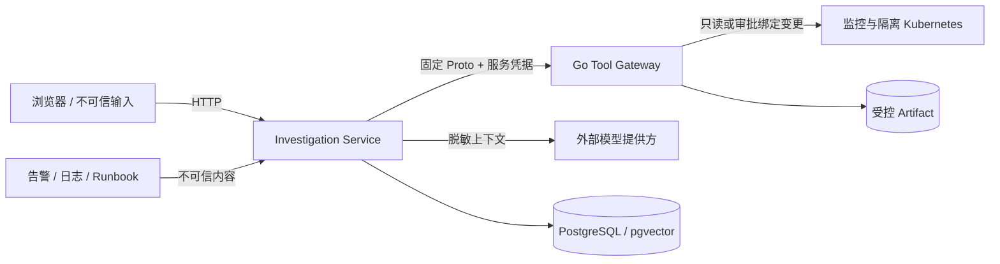

# V1 威胁模型

## 范围与资产

V1 只面向本机和隔离测试环境，不连接生产集群。主要资产包括模型/API 凭据、工具网关共享凭据、
Kubernetes 测试凭据、审批授权、调查证据、原始 Artifact、审计记录和数据集完整性。

信任边界如下：

## 威胁、控制与剩余风险

| 威胁 | 主要控制 | 验收 | 剩余风险 |
|---|---|---|---|
| Prompt Injection 诱导执行 | 外部内容标记不可信；固定工具；模型无集群凭据；变更独立审批 | AT-S06/S07 | 模型仍可能给出误导建议，必须人工判断 |
| 未审批、过期或篡改变更 | Go 端验证短期令牌、参数哈希、角色、命名空间和一次消费 | AT-S01～S05 | 审批者账号本身被攻陷不在 V1 范围 |
| 重放或重复副作用 | 持久幂等键和执行结果重放 | AT-S04 | 外部系统在响应丢失时仍需按执行状态核对 |
| 证据/日志泄密 | 工具输出脱敏；响应上限；原始数据转 Artifact；评测 API 只返回白名单字段 | AT-S08 | 第三方模型的数据治理取决于所选提供方 |
| 数据集或 Prompt 被替换 | 冻结 SHA-256、release manifest、Tag 与构建证明 | release workflow | Git 管理员权限失陷仍可替换仓库状态 |
| 数据源不可用导致幻觉 | 每源错误隔离；显式 evidence gap；有限预算 | AT-R03/F04 | 多数据源同时不可用时只能输出有限结论 |
| 资源耗尽 | 1～16 有界 worker pool；Compose CPU/内存/PID 限制；网关限流/响应上限 | Stage 7 probe | 单机 PostgreSQL 仍是容量与可用性边界 |
| 客户端伪造角色头 | V1 仅在本机隔离环境使用；Go 网关仍要求独立服务凭据和审批记录 | 部署边界 | **不能暴露到不可信网络**；生产化前必须接入可信身份代理 |

## 明确禁止的部署方式

- 不将 8000、8081 或 9091 端口暴露到公网。
- 不把浏览器提供的 `X-Actor-Role` 当作生产身份认证。
- 不给 Investigation Service 挂载 Kubernetes 管理凭据。
- 不关闭审批数据库或审计后降级执行变更。
- 不在生产环境启用测试床故障控制接口。

## 发布前复核

`make acceptance-stage7` 会重新执行安全测试、五并发、单源降级、资源配置、冻结评测和敏感模式
扫描。正式 Tag 工作流还要求 32 用例真实模型报告；缺少凭据、定价或在线报告时停止发布。
